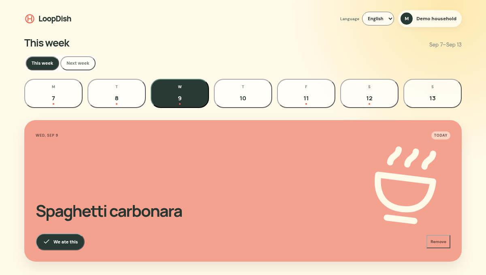

# LoopDish

**A shared dinner planner for the meals you actually make.**

LoopDish keeps your household's regular dishes, weekly plan, and dinner history together. Save the dinners already in your rotation, choose one for each day, and mark it eaten when the plates are empty.



## What it does

- Shares dishes, plans, and dinner history with your household
- Plans one dinner per day and remembers when you last ate it
- Suggests new dishes or drafts a week with optional AI
- Works in English and Danish and can be installed as a PWA

## Tech

LoopDish uses React, TanStack Start, Convex, WorkOS AuthKit, and StyleX. Cloudflare Workers AI provides meal suggestions.

To run it locally, use Node.js 22 or newer with [Vite+](https://viteplus.dev/), a Convex project, and WorkOS credentials:

```sh
vp install
pnpm dev
```

## Native iOS app

The SwiftUI client lives in `ios/` and uses the same Convex backend and WorkOS accounts. See [iOS setup and testing](ios/README.md) for Xcode instructions and the required native sign-in redirect configuration.
